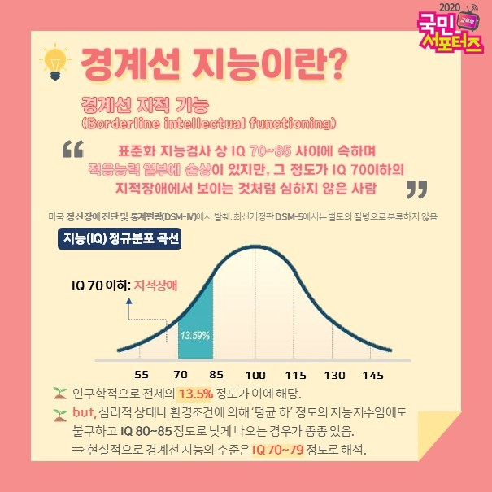

# 김영민 아이디어 정리

요약 내용(타이틀): Promenade(산책)

# Promenade(가벼운 산책)

## 기획 의도

### 경계선 지능 장애란?

- 일반인도 아닌, 장애인도 아닌 그 경계에 선 사람들
    - **경계선 지능이**란, 경계선 지적 기능(Borderline intellectual functioning)의 줄임말로 표준화 지능검사 상 IQ 70~85사이에 속하며 적응 능력 일부에 손상이 있지만, 그 정도가 IQ 74 이하의 지적장애에서 보이는 것처럼 심하지 않은 사람
    - 단순히 지능지수가 낮은 사람들인가? → X : 경계선 지능은 70~79의 지능지수 (이론상으로는 IQ 70~85) + 학업능력 저하, 대인관계 형성의 어려움, 사회활동 장애 등의 증상을 함께 동반하는 경우 경계선 지능이 의심
        - **인지적 특성** : 주의집중의 어려움, 저조한 기억능력, 복잡한 인지과제에 대한 브딤김. 개념 학습과 추상적 사고의 어려움, 전략적인 문제해결력 부족
        - **정서적 특성** : 미숙한 정서적 욕구, 위축, 타인을 쉽게 수용, 공격성 및 충동성, 우울감
        - **사회적 특성** : 어휘력 부족, 언어 표현력의 부족, 부족한 눈치, 사회적 기술의 부족
- 전체 인구의 1/7, **14%가 겪는 일**
- **경계에 머물면서 겪는 결핍과 사각지대 문제**를 해결하고자 주제 선정

## 타겟 선정

1. 경계선 지능 장애에 속한 아이들(성장기, 청소년기)
2. 이런 아이들의 부모들
3. 경계선 지능 장애를 가르치는 특수 교육 선생님, 상담사

## 문제점 제시

### 1. 느린 학습자

- 경계선 지능은 **정상 범주보다 낮은 지능을 갖기에 기본적으로 평균 이하의 인지능력**을 보임
- 이렇기에 다양한 분야에서 어려움을 겪음(위 사진 참조)

[경계선 지능인, “맞춤형 교육 고민할 때”](https://n.news.naver.com/mnews/article/056/0011485790?lfrom=kakao)

**Q. 교육을 통해 경계선 지능 아동의 지능이 정상 수준으로 회복될 가능성이 있나요?**

- 지능 자체가 향상될 수 있을지에 대해서는 논란의 여지가 있으나, 주어진 지적 수준 내에서 기능을 고양시키는 것은 충분히 가능하다고 볼 수 있습니다.

**Q. 그렇다면 경계선 지능 아이들을 일반 아이들과 같은 방식으로 교육하는 것이 맞을까요?**

- 이들을 일반 아이들과 같은 방식으로 가르치더라도 학습 부진 현상이 발생하기 쉽습니다. **따라서 일반 아이들과 함께 학습하는 시간 외에도 그들의 특성을 고려한 반복적 눈높이 교육이 필요합니다.** 특히 언어표현력과 사회성을 기르기 위한 연습이 필요한데, 보다 구체적인 예시를 통한 교육을 반복적으로 진행하는 것이 크게 도움이 된다고 합니다.

### 2. 교육 한계

- 남들보다 똑같은 것을 해결하기 위해 훨씬 더 많은 횟수의 반복이 필요함 → **일반인에 마련된 교육과정은 그대로 따라가기 어려움**
    - 일반 수업의 속도를 맞출 수 없고, 일반 과정을 수행하는 선생에게도 부담
- **물리적인 지원이 부족한 상황** - 특수교육, 사교육 비용 등
    - 이유 : 비장애인이니까 장애인의 복지 혜택을 누릴 수 없음
- 이러한 이유로 경계선 지능의 아동들이 **학교를 중도에 그만둘 확률 10배**
- 학업적 개입이 경계선 지적 기능 아동의 적응, 의사소통, 인지기능을 증진 시키는데 매우 효율적 / **적절한 개입이 없을시 지능지수가 점점 감소**

### 3. 비대면 교육으로

- 물리적인 지원이 부족한 이유? : 대부분의 느린 학습자를 위한 교육은 국가지원이 어렵기에 학부모 위주로 교육 / 혹은 방대한 비용의 사교육으로 충당
- 비대면으로 교육을 책임진다면 학부모의 부담이 줄어들고, 포기하지 않는 마음을 심어준다.
- 느린 학습자만을 위한 스텝을 만들어 줄 수 있지 않을까?

## 핵심 기능

### 1. 인지 능력 교육

[기초학력향상지원사이트-꾸꾸](http://www.basics.re.kr/main.do)

- 아이들에게 공부가 좋다라는 인식 향상 및 적절한 인지 능력 향상을 위한 게임 개발

- 정서적 안정을 줄 수 있는 게임 개발(캔버스 활용)

- 모든 교육 속에 웹 캠으로 학습자의 모습을 녹화해, 학습에 잘 적응하는지, 어려움은 없는지 파악하는 수단이 있다면?
- 얼마나 학습하는지를 해당 학부모, 교사가 확인할 수 있다면?
- 난이도에 맞춰 셋팅하는법? → 해당 학부모와 교사가 설정할 수 있다면?
- 무제한으로 학습하기, 학습을 계속해서 반복하는 방법

### 2. 상황 해결 교육

- 상황에 대해 끊임없이 생각할 수 있는 교육 프로그램
- 채팅으로 정답을 맞추기 , 음성으로 정답을 맞추기
- 해당 내용을 잘 이해할 수 있도록 시청각 자료 제공

- 교육 프로그램의 비대면화

### 3. 사회성 교육

- 1: N 관계의 화상 채팅 을 통해서 서로의 사회성을 기를 수 있는 프로그램
- 앞선 2. 상황 해결 교육의 연계로 진행 할 수 있음

### 4. 1:1  맞춤 상담

- 비대면 교육의 한계점 : 제대로 교육이 진행되고 있느냐를 파악하기 어려움
- 그로 인해서 맞춤 상담이 필요
- 학습자의 학습 데이터를 가지고 상담을 하는데 도움을 줄 수 있다

### 5. 부모를 위한 커뮤니티?

- 같은 입장의 부모들을 위한 커뮤니티

[느린걸음(장애 보호자 및 재활 전문가... : 네이버 카페](https://cafe.naver.com/loosebaby)

## 차별점

- 교사가 함께해야하는 부분을 비대면 교육을 통해 접근 → 물리적인 한계 및 궁극적인 기획 의도 실현
- 

피드백