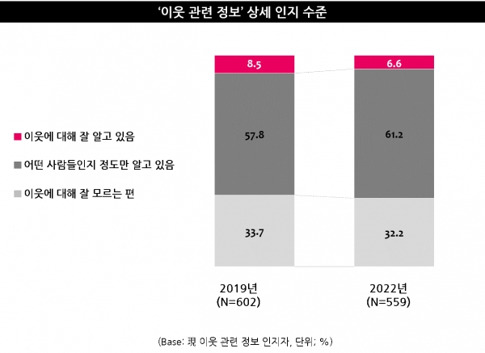

# 노수혁 아이디어 정리

요약 내용(타이틀): 동네 이웃 SNS

# 동네 주위 이웃 찾기 서비스

### 아이디어 기획 배경

- 과거에 비해 주위 이웃의 인식률 자체가 낮아지는 추세를 보임
- 반면에 1인 가구가 증가하는 추세를 보임

- 이웃과의 교류가 줄고, 인식률 감소는 이웃에 대한 무관심으로 이어지고, 이는 고독사 비율의 증가로 이어지는 악순환이 이어질 수 있음

- 개인주의적 성향이 강해지는 반면, 자신과 취미나 여러 정보를 공유하고 나눌 수 있는 동네의 친구를 필요로 하는 사람 또한 증가하는 양상을 띔

### 페르소나(대상 고객)

- 타지로 이사를 가서 해당 지역에 아는 사람이 없지만, 자신과 잘 맞는 주위 친구를 찾고자 하는 사람들
- 자신과 같은 취미를 가지고 있는 사람과 취미 생활을 하고자 하는 사람들

### 현재 운영되고 있는 유사 서비스

1. [위피](https://play.google.com/store/apps/details?id=net.nrise.wippy&hl=ko&gl=US)(app)
    - 자신의 프로필을 등록 후 관심사나 취미가 유사한 인원들과 연락이 가능
    - 자신의 일상글을 올리고 공유 가능
    - 보이스톡 기능을 제공
    - 실제 지인은 나타나지 않도록 설정 가능
    - 자신의 동네에서 자신의 인기 순위가 출력
2. [심쿵](https://play.google.com/store/apps/details?id=com.colondee.simkoong3&hl=ko&gl=US)(app)
    - 자신의 프로필 등록
    - 주위 거리별 어플을 설치한 친구 목록 표시
    - 친구와 채팅 기능
    - 지인이 추천되지 않는 기능
    - 나에게 관심있는 사람과 연결
3. [동구](https://www.daldaltown.com/dongu)(app)
    - 시간, 장소, 활동을 선택 및 게시하여 원하는 참가자를 모집
    - 모집이 완료되면 약속을 확정하여 모임을 진행
    - 약속 공유 및 해당 사진 게시글 업로드
    - 약속 모임인원끼리의 채팅 기능
4. [아만다](https://play.google.com/store/apps/details?id=com.dorsia.amanda&hl=ko&gl=US)(app)
    - 자신의 프로필 등록
    - 익명 커뮤니티 기능
    - 실시간으로 접속해 있는 근처 동네 친구 확인 가능

### 문제점

1. 데이트 앱과 차별점이 없는 기존 서비스들
2. 익명성 뒤에 숨은 성적 발언

### 핵심 기능

- 거리 기준 최대 5km 이내의 비슷한 연령대와 같은 취미의 사용자만을 추천

- 데이팅 앱으로의 기능 변질을 막기 위해 본인 인증을 다양한 방식으로 할 수 있도록 설정

- 친구와 채팅 및 보이스 / 영상 통화 기능

- 같은 취미를 가진 지역 내 사람들의 추천 장소 및 리뷰를 통해 다양한 정보 제공

## 피드백

- 원하는 프로젝트가 있는 것으로 보이는데, 이러한 과정을 프로세스로 정리하기 어려워보이고 실제 사용자도 쓰기 어려울 것임. 서비스 차별점을 주기 어려움. 

- 이러한 서비스는 보통 하나의 특징이 있고, 이후 사용자에게 사용 방법을 맡기기 때문에 제공 가능한 서비스가 다양해야 한다. 특별한 부가 기능을 추가적으로 제공해야 활성화 될 것으로 보임.

- 당근 마켓 - 동네 생활과 유사하다고 생각함. 또한 맘카페같은 곳에서는 오프라인 행사 등을 진행하는 등 활성화가 잘 되어 있는데 어떻게 진행되고 정보가 전달되는지 확인해보면 좋을 것.

- 해당 프로그램을 사용할만한 차별점이 필요함, 지자체와의 연계를 통해 이용 시 가격적인 부분에서의 혜택이나 여러 가지의 추가적인 제공 요소가 필요해보임.
