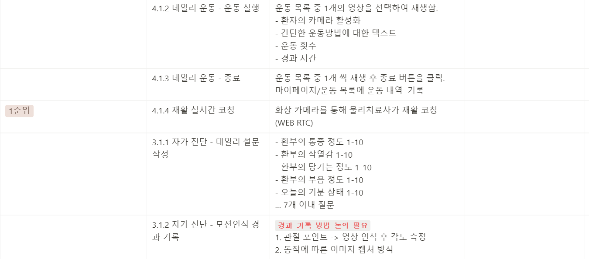
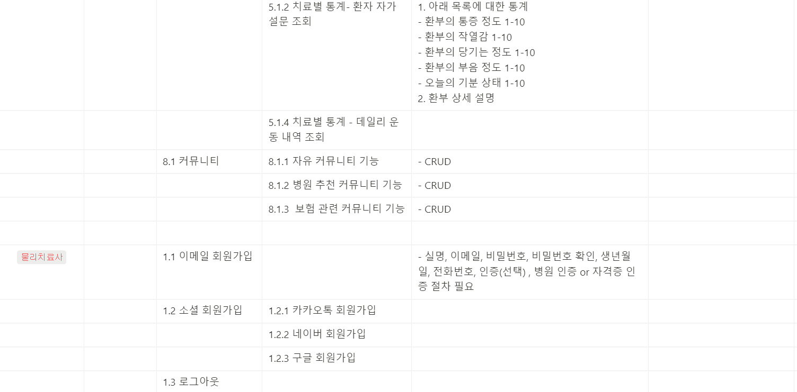
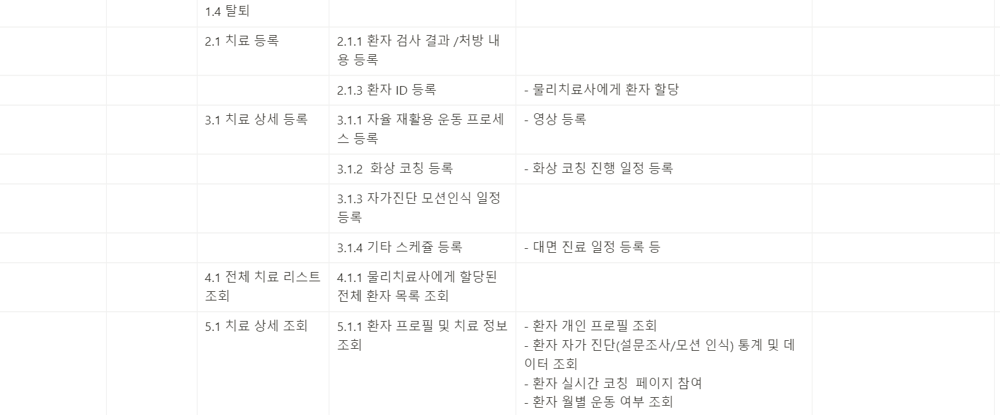
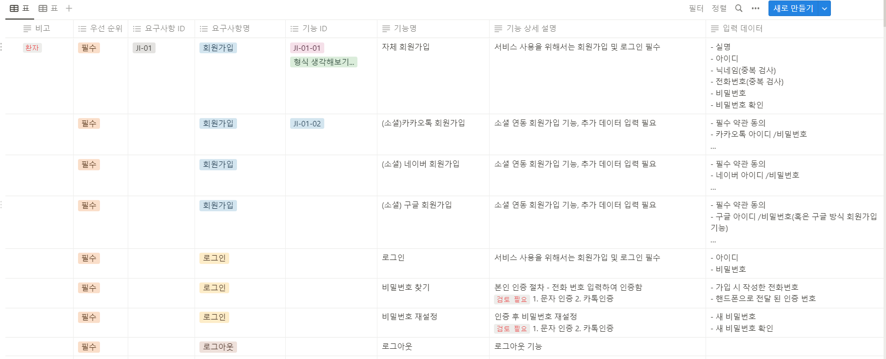

## 23.07.11

### 작업 내용

- 기획안 컨설팅
- 유저 스토리 및 기획 내용 추가 작성
- 기능 명세서 정리

- 해야 할 작업

1. 기능 명세서 완성하기(자료참고)
2. 와이어프레임 기획

## 23.07.12

### 작업 내용

- 요구사항 명세서 작성
- 회의를 통해 주요 기능 추가
- 회의를 통해 주요 기능 추가
- 테마 컬러 및 컨셉 논의

- 요구사항 명세서 작성(미정 주요 기능 추가 논의)
- 와이어프레임
- 와이어프레임

## 23.07.14

### 1팀

- 아이디어 주제 : 비대면 스터디 플랫폼
- 내용:

1. 스터디 환결 설정 및 생성
2. 원활한 스터디를 위해 코드 동시 편집/컴파일 기능
3. 음성 실시간 통신
4. 코드 별 색 구분

- 질문

1. 파이참 -> 서비스로 코드 옮겨서 진행되는가
2. 유저가 악성 코드를 컴파일 할 경우에 대한 대비
3. 기능에 대한 상세 질문 : 코드를 복사하여 넣으면 함께 수정
4. 코드 동시 수정에 대한 질문

### 2팀

- 아이디어 주제 :냉장고의 잊혀진 재료를 관리하는 서비스
- 내용:

1. 냉장고안의 재료를 바탕으로 맞춤형 레시피 제공
2. 음식물 쓰레기를 줄임

- 질문

1. 진짜 음쓰를 줄일 수 있는 효과가 나는가?
2. 개인 취향에 맞춘 레시피 제공 방법?
3. 기능에 대한 상세 질문(재료입력 하면 매치되는 것만 보여주는가? - 재료와 매칭되는 레시피 유사도를 보여주는 것이라 함.)
4. 유사어/사투리/음성이 잘못 입력되었을 때의 대처
5. 앱이 더 적절하지 않은가?
6. 조리 환경에 대한 필터링?

### 3팀

- 아이디어 주제 : 개쩔었음
- 내용: 미쳤음
- 질문

### 1. 치료리스트를 기입하는 과정은 어떻게 이루어질까?

- 관리자 페이지를 만들어 데이터를 올려두면 선택하는 방식이나 추후에는 커스텀 가능하도록 만들 예정.

### 2. 환자가 운동 내역 기입 할 때는?

- 처방 / 개인 운동이 있을 텐데 필요한 각도를 보여줄 수 있는 사진을 찍어 1차 자가 검진 후 끝나고 설문을 통해 보완해 통계 데이터를 의료진에 전달하여서 운동 관련 정보를 전달

### 3. 대면 / 비대면을 동시에 진행 할 수 있는데 같은 치료사인지?

- 전체 적인 치료를 관리하는 것은 물리치료사이고, 대면할 때는 물리치료사 / 의사 일 것.

### 4. 1대1 매칭인 것 같은데, 집에 방문 하는 것인지?

- 유저 케이스 : 다리를 다쳐 병원에 방문한 환자. 이 때 물리치료사를 배정 받았을 떄, 이 서비스를 소개시켜주고 매칭이 됨.
- B2B로 병원에서 사용하는 서비스. 병원의 마케팅 수단이자 치료 수단으로 사용

### 5. 원격 진료 서비스인데, 물리치료의 경우 노인 층에서 사용을 많이 할 것이라고 생각하는데 시골에서 병원에 오기 힘든 사람들이 쓰지 않을까? 라는 생각이 드는데 UI/UX 측면에서 보완이 필요하지 않을까?

- 우리 타겟은 웹 페이지 사용 / 웹 캠을 사용하는 30대라고 생각하지만 제안한 타겟층도 사용할 수 있음. 근데 그런 환경에서는 병원 방문도 어려울 것이다. 이건 좀 더 보완 예정

### 6. 환자의 자가 진단 / 영상으로 진단 할 텐데, 진단의 신뢰성이 낮아지지 않을까? 가까이서 봐야 하는 것 아닌가? 신뢰도를 높일 수 있는 추가 수단이 있을까?

- 이 서비스 만을 활용해서 완치의 과정까지 갈 수는 없다. 대신 그 부분을 좀 더 편리하게 접근할 수 있도록 만드는 것이 우리의 접근 방법임.
- 1. 모션 인식을 하여 해당 부분에 대한 각도를 코칭 / 자가진단으로 볼 수 있음. 딱 한번의 치료로는 해당 경과를 알 수 없지만 데이터가 쌓이면서 나아지고 있는가를 충분히 볼 수 있는 데이터가 쌓임.
- 2. 병원에 갈 수 없는 시간 / 가는 데 소요되는 시간 / 접수되는 시간 등... 이런 부분을 줄여 편의성을 높이는 보조 서비스이자 환자에 대한 정보를 더 상세히 아카이빙 할 수 있는 서비스이므로 치료 보조에 쓰일 수 있을 것.
- 이 부분 최종 발표때도 이렇게 보완했다~ 얘기하면 좋을 것 같다.

### 7. 우리의 처방 데이터가 얼마나 효과가 있을까?(기기의 부족 등..)

- 기구가 필요한 것도 있고 기기가 필요할 수 도 있지만 스트레칭 뿐만 아니라 통증 완화 운동, 강화 운동 등등... 이런부분을 함께, 효과적으로, 시간을 단축하여 진행할 수 있을 것.

### 8. 의료법 관련

- 처방은 의사가 하는 것이다. 이후 주기 별로 체크하고, 의사와 물리치료사는 시트를 공유하는 것. 대면 처방이 들어가 의사가 처방을 하고 치료를 지속적으로 하는 것이기 때문에 관련 문제는 없을 것.

### 9. 물리치료사에게 어떤 이득이 있을까? 업무가 줄어드는 가?

- 환자에 대한 이해, 매일 해야하는 질문 등...이런 부분을 파악하는데 시간이 오래 걸리고 이를 파악하지 못하면 환자에 대한 치료의 진척이 느려질 수 있음.

### 10. 노인 분들이 타겟이 될 수 있을 것. 그러나 스마트폰 하나 정도가 사용 하는 기기일텐데, 사용성?

- 일단 타겟팅한 목표가 다르다 : 30대를 생각함.

### 11. 원격 / 대면과 시간 차이가 없지 않나?

### 12. 금액적인 측면에서 병원이 쓸 이유가 없지 않나?

- 치료 프로세스에 대해서 대면일 때

1. 내원 / 접수
2. 물리치료사와 대면하여 대화를 통해 진료를 하지 않은 기간 동안의 트래킹

- 근데 여기서, 일주일 전에 운동할 때 아팠는지 물으면 그 기억은 명확하지 못할 것
- 일 주일간 운동을 다 하지 않았을 수 있음(목표 만큼 완전히 하지 않거나 제대로 된 각도가 나오지 않거나 등등)
- 물리치료사는 이런 내용을 모른 채 경과를 보고 처방을 할 것임.
- 명확하지 않는 내용을 바탕으로 새로운 처방 / 혹은 유지 할 때 결론적으로 환자에게 맞는 처방이 아닐 수 있음

3. 장소를 옮겨 운동 코칭 후(근데 이제 자리가 없을 수 있음 이 요소를 고려해서 예약해야 함 ) 환자에 대한 정보 따로 작성 등 서류 작업

- 우리 서비스 사용할 때

1. 환자가 매일매일, 직접 자료를 작성하며 통계를 쌓아감.
2. 물리치료사는 이 자료를 통해 진료시간이 아닐 때 혹은 남는시간에 미리 진단을 작성해두거나 저장할 수 있음.
3. 자율적으로 운동 했는지 여부/ 과정 확인 가능.
4. 실시간 처방시에도, 환자가 환부에 대한 느낌이나 만족도가 자동으로 저장되며 물리치료사는 자리를 옮기거나 운동 환경을 정리하는 등...이런 요소가 필요 없다. 제약 없이 예약 가능, 시간 줄어듬
   -> 서류 작성이나 환자 관리에 대한 환경이 좀 더 최적화됨.

## 병원에서 해당 서비스를 사용해야 하는 이유

### 1. 환자의 평소 습관 /재활 운동 습관에 대한 정보 아카이빙 가능

- 과거에 대한 기억은 완전하지 못할 수 있으며 얼마나 아팠고 어떤 증상이 있을 지를 병원에 갔을 때 생각해내기는 어렵다. 반면 데일리과제의 형식으로 Task를 전달하고 이에 대해서 작성하면서 하루하루 쌓이는 데이터는 의료적으로 충분히 도움이 될 것임.

### 2. 환자의 치유 속도 / 환자 케어

- 이러한 데이터를 바탕으로 자세한 재활 운동을 등록하고 경과 및 만족도를 바탕으로 운동 프로세스를 변경해줄 때 환자에게 더욱 최적화된 의료 서비스를 제공함.
- 환자에게는 이러한 부분을 통해 자신의 환부에 대해 더 신경 써준다는 느낌을 받고 서비스에 대한 좋은 인상 -> 병원과 치료사에 대해 좋은 인상을 남길 수 있을 것.

### 3. 물리치료사의 근무 시간 절약/ 효율적인 환자 관리

- 운동에 대한 통계, 자세한 통증 완화 정도 트래킹, 프로세스에 대한 만족도를 볼 수 있음.
- 근무 환경을 옮기지 않고 사무실이라는 한 공간에서 업무 가능.
- 예약 시 공간 예약 등...이런 부분 신경쓰지 않고 시간만 고려해서 환자 예약 가능.
- 환자가 병원 서비스 / 운동에 대한 만족도 등에 대해서 어떻게 생각하는지 계속 물어보는 시간을 줄일 수 있음. 좀 더 최적화된 서비스 제공 가능.

### 4. 마케팅에 대해서...

- 개인적으로 물리치료사가 개인적으로/ 혹은 마케팅 서비스로 사용하는게 아니라 치료 및 처방 과정 중 하나로서 사용된다고 생각함! 물론 비용이 들 수는 있음.
- 코칭 서비스에 대해서만 비용이 들지 않을까.

### 4팀

- 아이디어 주제 : 실시간 번역 랜덤 화상 채팅
- 내용:

1. 실시간 언어 자막/번역을 통해 화상채팅
2. 소통을 위한 주제 / 게임 기능

- 질문

1. 폭력/음란성 채팅에 대한 필터링
2. 외국인 유입 과정
3. 브라우저 끼리 연동 시 실시간 번역 - 음성과 자막이 나오는건지? 프로세스에 대한 질문
4. 속도와 정확성에 대한 질문

### 5팀

- 아이디어 주제 : 블라인드 원격 소개팅
- 내용:

1. 서로의 얼굴을 알지 못하는 상태로 소개팅 시작
2. 마음에 들면 얼굴 볼 수 있음.
3. 향후 대면 만남 장소 설정
4. 지인 차단 설정

- 질문

1. 살색 문제에 대해서...

- 신고하는 방식으로 해결

2.

### 6팀

- 아이디어 주제 :.
- 내용:.
- 질문.

### 7팀

- 아이디어 주제 : 소중한 나의 아이를 위한 다이어리
- 내용:

1. 양육 과정을 기록/공유하는 서비스
2. 육아 과정에 대한 기록을 분석(시각화)하여 제공
3. 예방 접공/ 프로필 관리 / 앨범 생성 기능

### 8팀

- 아이디어 주제 : 소상공인 협력 플랫폼
- 내용 :

1. 소상공인들이 판매하는 물품을 등록하여 판매
2. 할인 가격으로 물품 올릴 수 있음
3. 커뮤니티를 통해 지역 가게 들의 커뮤니티 공지 기능
4. 연계 세일 가능(상인/유저간?실시간 통신 가능)

- 질문 :
  1. 분탕에 어떻게 대처할 수 있을까
  2. 사용 연령
  3. 결제 시스템 적용 방안
  4. 인스타그램과의 차별성

### 9팀

- 아이디어 주제 : 마약 중독에서 벗어날 수 있도록 돕는 커뮤니티
- 내용:

1. 중독 고민 커뮤니티
2. 실시간 상담/소감문 작성
3. 커뮤니티

- 질문

1. 사용성(익명이 아닐 때 쓸 수 있을까?, 심리학적으로 접근)
2. 마약이라는 주제에 너무 매몰되어 있다. 아이디어 확장성

### 10팀

- 아이디어 주제 : .
- 내용: .
- 질문: .

### 주말 작업 리스트

지원 : 와이어 프레임 메인 페이지 -> 치료페이지 까지 큰 틀 짜보기-> 와이어프레임 상세 논의
수혁 : 시퀀스프레임-> 와이어프레임 상세 논의
영민 : 지라 -> 와이어프레임 상세 논의

### 23.07.17

- 작업 :

1. 와이어프레임 그리기 완료
2. 회의

- 회의 내용

1. 기획서

- 비대면 재활 서비스의 패러다임 : 더 좋은 효과가 나는가?
- `모션 인식 활용 : 비대면 재활 서비스의 한계를 극복(정밀한 데이터 측정, 전문적인 운동 수행 지시 등)`라는 부분을 좀 더 명확하게 추가할 것.

2. 간트 차트

- 개인별로 간트 차트를 작성할 것.
- 업무도 좀 더 자세하게 논의할 것.(기능 명세에 작성한 내용이 나와야 함)

3. 요구사항 정의서

- 핸드폰 번호가 바뀌었는데, 다른 유저가 해당 번호를 사용하고 있는 상태에서 회원가입할 때에 대한 경우를 생각해봤는가?
- 카카오톡 회원 가입 시 소셜로그인 아이디 비밀번호, 로그인 없음, 로그아웃 -> DB에서 토큰 정보 날리기
- 회원 가입 이후 인적 사항 작성으로 바로 이어짐(순서 바꿀 것)
- 화상 코칭 시 화면 캡처 -> 전체 코칭 세션을 전부 저장하는 기능이 더 필요할 것.
- 대면의 경우, 바로 완료로 이어짐(코칭과 연관 없음)
- 관리자 : 물리치료사 삭제 기능 추가할 것
- 탈퇴 : 활성화 / 비활성화 여부로 탈퇴를 1차 체크 한 뒤 일정 기간이 자나면 삭제하는 방식으로 수정
- 환자 검색 시 : 이름 검색 하면 아이디와 함께 검색됨
- 화상 코칭 시 할당 : 대면 시 등록하고 알림(알림 기능 추가)
- 대면 등록 스케줄 등록 논의 역시 동일함
- 관리자 : 데이터에 관한 수정 권한(물치/일반환자의 데이터 수정 권한)

4. 와이어 프레임 :
1. 물리치료사의 치료 및 처방 페이지에 text area가 너무 많다. 간단하게 선택할 수 있는 에디터는 줘야 할 것.
1. 처방 프로세스 할당(운동) - 물리치료사 페이지에 강도 잘못 표시된 것 수정
1. 치료 리스트 조회 - 환자 페이지에서 달력을 추가하는 것에 대한 의견.(추가해야 할 듯...)
1. 인적 사항 작성 - 환자 페이지에서 회원 가입 완료가 아닌 정보 저장 완료 등 다른 메세지로 작성

1. ERD :

- 환자 : 소셜일 때 테이블 고려
- 치료사 : 치료가 하나 이상인데 연결이 잘못 됨

### 23.07.17

- 작업 :

1. 와이어프레임 그리기 완료
2. 회의

- 회의 내용

1. 기획서

- 비대면 재활 서비스의 패러다임 : 더 좋은 효과가 나는가?
- `모션 인식 활용 : 비대면 재활 서비스의 한계를 극복(정밀한 데이터 측정, 전문적인 운동 수행 지시 등)`라는 부분을 좀 더 명확하게 추가할 것.

2. 간트 차트

- 개인별로 간트 차트를 작성할 것.
- 업무도 좀 더 자세하게 논의할 것.(기능 명세에 작성한 내용이 나와야 함)

3. 요구사항 정의서

- 핸드폰 번호가 바뀌었는데, 다른 유저가 해당 번호를 사용하고 있는 상태에서 회원가입할 때에 대한 경우를 생각해봤는가?
- 카카오톡 회원 가입 시 소셜로그인 아이디 비밀번호, 로그인 없음, 로그아웃 -> DB에서 토큰 정보 날리기
- 회원 가입 이후 인적 사항 작성으로 바로 이어짐(순서 바꿀 것)
- 화상 코칭 시 화면 캡처 -> 전체 코칭 세션을 전부 저장하는 기능이 더 필요할 것.
- 대면의 경우, 바로 완료로 이어짐(코칭과 연관 없음)
- 관리자 : 물리치료사 삭제 기능 추가할 것
- 탈퇴 : 활성화 / 비활성화 여부로 탈퇴를 1차 체크 한 뒤 일정 기간이 자나면 삭제하는 방식으로 수정
- 환자 검색 시 : 이름 검색 하면 아이디와 함께 검색됨
- 화상 코칭 시 할당 : 대면 시 등록하고 알림(알림 기능 추가)
- 대면 등록 스케줄 등록 논의 역시 동일함
- 관리자 : 데이터에 관한 수정 권한(물치/일반환자의 데이터 수정 권한)

4. 와이어 프레임 :
1. 물리치료사의 치료 및 처방 페이지에 text area가 너무 많다. 간단하게 선택할 수 있는 에디터는 줘야 할 것.
1. 처방 프로세스 할당(운동) - 물리치료사 페이지에 강도 잘못 표시된 것 수정
1. 치료 리스트 조회 - 환자 페이지에서 달력을 추가하는 것에 대한 의견.(추가해야 할 듯...)
1. 인적 사항 작성 - 환자 페이지에서 회원 가입 완료가 아닌 정보 저장 완료 등 다른 메세지로 작성

1. ERD :

- 환자 : 소셜일 때 테이블 고려
- 치료사 : 치료가 하나 이상인데 연결이 잘못 됨

### 23.07.18

- 명세서 수정
  https://www.notion.so/60e17ab801344b8bb0e71cc3ec8f7845?pvs=4

- 와이어 프레임 수정
  https://www.figma.com/file/4eUuvq4cYsk4WrxFi3NlzA/Join-it-%ED%99%98%EC%9E%90-%ED%99%94%EB%A9%B4?type=design&node-id=8%3A3684&mode=design&t=7HWoSLp25R2bR31i-1

### 23.07.19

- 간트 차트 : 추후 전체 인원의 일정을 모두 합쳐서 하나 더 만들기
- erd :

  - 회원 상태에 대해 활성화/휴면 등 상태 값이 하나만 있지 않을 것.
  - 상태 전체 관리를 해야 하므로 y/n으로만 할 수 는 없음. (회원 상태라는 값으로 분류하기)
  - 치료사 : 승인 여부에 대해서, 관리자페이지에 승인 여부를 넣음(0 - 승인전 1- 승인 후 일반 3- 근무자가 아닐 때 등…)
  - 환자 : 가입할 때 닉네임에 대해서.
  - 기타 질환 : 만약 이 후 etc를 변경 할 때 등 확장성을 대비해서 테이블로 따로 빼는 것이 좋을 것.(고유 질환은 공통 코드로 구분)
  - 환자별 색상 - 공통 코드로 작성
  - 관리자 - 관리자 관리 페이지가 필요할 것. 또한 관리자 별로 레벨이 다를 것(참고)
  - 로그 테이블 : 1대 다인 이유? 로그 데이터는 특정 데이터없이 생성될 수 없음
  - 커뮤니티 : 선택 기능으로, 확장을 위해 작성함.
  - 에디터는 추가할 것.
  - 코칭 코멘트 : 30분 단위고, 화면과 음성을 공유, 캡처 이미지와 코멘트를 작성함.
  - 영상 녹화 : 비용 생각하지 말고 서버에 올리기
  - 커뮤니티 - 추후 볼 것.

- 인터페이스 설계서
  - json에서 앞의 “name” 등 각 요소에 뭐가 들어갈 지 넣어야 함.
- 시퀀스 다이어그램
  시퀀스의 유저를 하나로 합칠 것. - 치료사 : 환자 가입 후 이름을 검색해서 할당하는 행위에 대해서, 회원 가입 후 물리치료사가 환자를 등록하는 등…서로를 제대로 인식할 수 있는 프로세스가 필요할 것이다.
- 환경 설정 :
  - 깃 - 새로운 인원이 해당 서류를 봤을 때 바로 적용할 수 있도록 예시 추가하기

### 23.07.20

- 개발 환경 가이드 수정

# [GIT] 컨벤션

## 1. Prefix

`Feat` : 새로운 기능을 추가

`Fix` : 버그 수정

`Design` : CSS 등 사용자 UI 디자인 변경

`!BREAKING CHANGE` : 커다란 API 변경의 경우

`!HOTFIX` : 급하게 치명적인 버그를 고쳐야 하는 경우

`Style` : 코드 포맷 변경, 세미콜론 누락 등 스타일과 관련된 코드 수정, 그러나 코드 수정은 없는 경우

`Refactor` : 코드 리팩토링 (코드 전면 수정)

`Comment` : 필요한 주석 추가 및 변경

`Docs` : 문서 수정

`Test` : 빌드 업무 수정, 패키지 매니저 수정, 패키지 관리자 구성 등 업데이트

`Rename` : 파일 혹은 폴더명을 수정하거나 옮기는 작업만 수행할 경우

`Remove` : 파일을 삭제하는 작업만 수행한 경우

`Chore` : .gitignore 처럼 외부 사용자가 관심없는 파일, 빌드 혹은 패키지 매니저 수정 사항

`Update` : 개정이나 버전 업데이트가 있을 경우

### 2. 커밋 메세지 작성 양식

[**태그명]: #[JIRA 이슈 번호] [메세지]\*\*

- 대괄호 별로 띄어쓰기, 메시지는 명사로 맺음말을 작성합니다.
  - 지라 이슈 코드 앞에는 #을 붙여 태그 뒤에 작성합니다.

### . JIRA 이슈명 양식

**[주제-개발단위] 날짜 작업내용**

**주제**

- 개발/UI/서류 등 이슈의 주제.
- EX) BE, FE, UI, Infra, Docs, Lec, Plan ...

**개발 단위**

- 서비스 내 기능/페이지 등 개발 단위.
- EX) 회원, 치료, 처방, RTC, ...

**그 외 규칙**

- **대괄호** 뒤에는 띄어쓰기 한 칸을 두고 내용을 작성합니다.
- **날짜** 뒤에 띄어쓰기 한 칸을 두고 내용을 작성합니다.
- **날짜**는 \*\*\*\*4글자 포맷으로 작성합니다.

<aside>
💡 **JIRA 이슈 예시**

[BE-회원] 0720 로그인 기능 개발

[FE-치료] 0720 치료 입력 기능 개발

[UI-RTC] 0720 화상 코칭 UI 디자인

[Docs] 0720 API 설계 보완

</aside>

# 23.07.21

## 요구사항 정의서

- 통과

## 와이어 프레임

- 메인 페이지 한 번 뜨고 안뜨나요?
  - 로그인 하면 안뜸
  - 한 번 나왔으면 안 나올거면 키 값이 DB에 있어야 함
- 에디터 안 만들어도 됨
  - 어디 꺼 갖다 쓸 건지 정하기
- 물리치료사가 화상 코칭 시 볼 수 있는 환자 정보 탭 화면
  - 그 부분을 중점적으로
  - 화상 코칭에 개발 우선순위를 두자

## ERD

- 굳..

## 시퀀스

-

## api 명세

- URI 하이픈
- 처방 7, 8 → id 넘길 때 무슨 id를 넘기는지
  - URI 다 카멜로 합치기
- bold 이슈..
- int에도 다 글자 수 넣기

→ int 숫자 넣고, 카멜 케이스 바꾸면서 전체 한 번씩 슬쩍 확인합시다~!

→ 어딘가 String으로 되어있을 수 있음 ㅎㅎ..

# !통과!

---

코딩왕의 질문

## 중복 제거 vs 직관성

- 서버는 데이터베이스를 한 번만 조회

**key는 절대 auto_increment를 사용하지 않는다**

---

## jira

- 팀 다같이 하는 것들은 모두 다 올려야 함
- 이슈 이름 컨벤션 맞추기
- 이슈는 한 두 개만 먼저 만들기.. 전부 다 만드는 것은 안됨

# 23.07.24

- 컴포넌트 트리 작성 및 역할 분배

# 23.07.25

- 컴포넌트 구조 작성
- 치료 등록 페이지 및 에디터 추가
