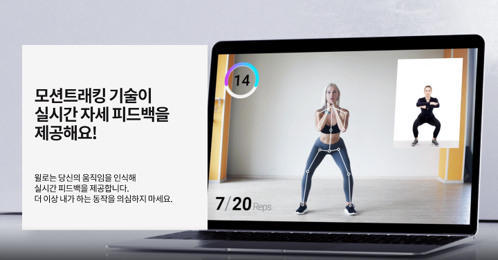
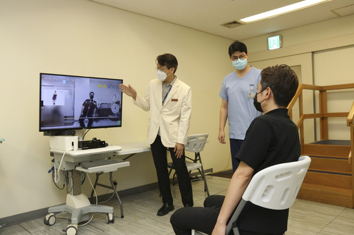
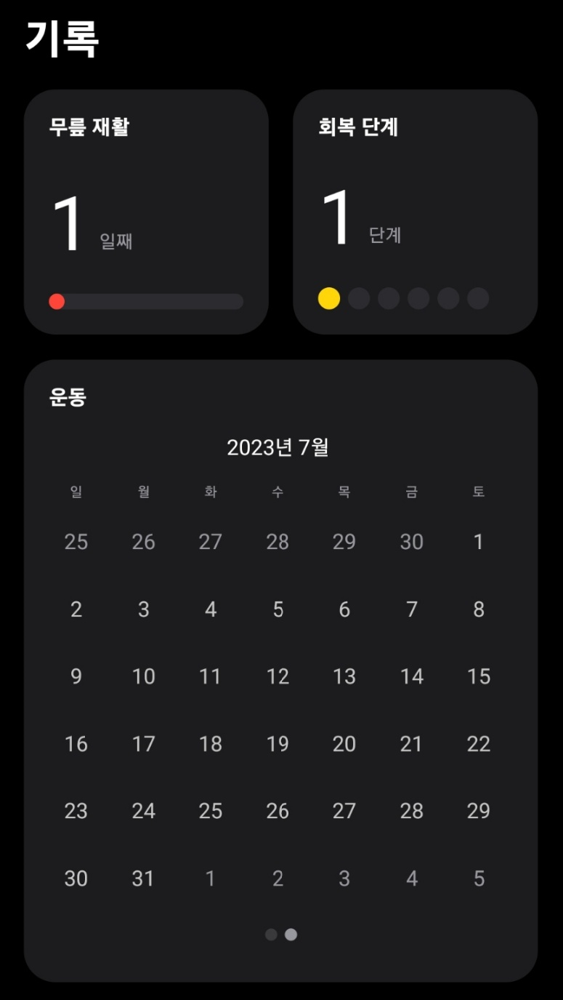
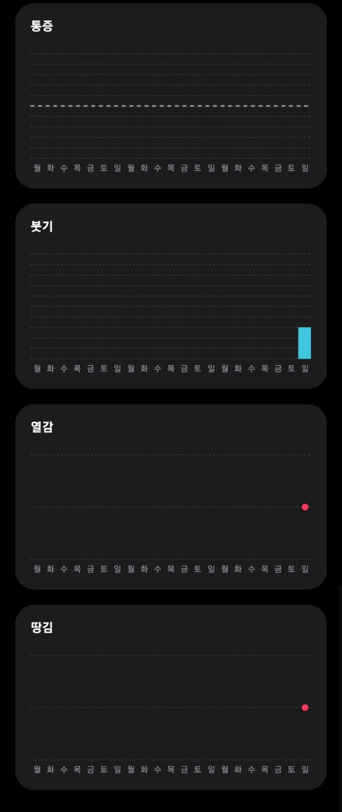
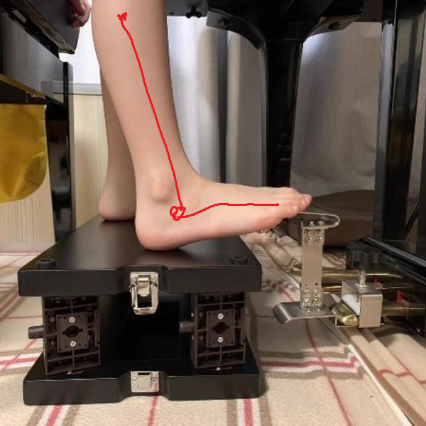
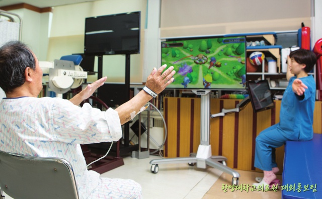

# 🏃**모션 인식을 활용한 재활 (혹은 도수치료 서비스)**

## 기획 배경

### 1. **사고 후 일상 복귀의 어려움 - 재활의 필요성**

> **"많은 중환자들이 퇴원 후에도 일상 복귀의 어려움을 호소하고 있다."**
> 
> 
> 대한중환자재활학회가 중환자재활 수가 개발을 위해 팔을 걷었다. 현재 중환자의 치료 목표가 생명을 살리는 데 초점을 맞추고 있어 `퇴원 후 직장 등 일상 생활으로의 복귀가 쉽지 않다`는 지적에 따른 것.
> 
> …
> 
> 중환자실치료후증후군이 발생한 환자들은 `팔다리 근육쇠약`으로 스스로 걷지 못하고, 치매와 같은 `인지장애, 기억력 감퇴`로 인해 주위의 도움 없이는 스스로 일상생활이 불가하게 되며, 우울증이나 외상후증후군으로 정신적 고통을 호소하기도 해 '재활'의 필요성이 부각되고 있다.
> 
> …
> 
> 이어 "특히 현대 의학에서 조기 가동의 중요성이 증가하고 있고 중환자에서의 `적극적인 재활치료가 환자의 재원기간 단축, 합병증 발생 감소 및 신체 기능 호전에 효과적`"이라며 "이에 국내 중환자에서도 재활치료의 요구 및 시행이 지속적으로 증대되고 있다"고 설명했다.
> 
> 현재 국내에선 **의료보험 수가가 상대적으로 높은 질환에 대해서만 선택적으로 재활치료가 이뤄지고 있고, 중추신경계 외 질환으로 중환자실 치료를 받고 있는 환자들에게 수가 문제로 재활 치료가 적용되지 못하는 상황이다.**
> 
> [중환자 퇴원하면 끝난다? 재활없이 일상 복귀도 없어](https://www.medicaltimes.com/Main/News/NewsView.html?ID=1150506)
> 

### 2. **근로복지공단 최소 재활 서비스 제공 기간, 2개월**

- 산재로 인해 근무가 어려울 경우 재활 서비스를 제공하지만 후유증이 남는 사고가 발생해도 공단 기준 경미한 수준일 경우에는 `2개월`로 제한함(보다 심각한 환자를 위해 연장X)

→ 이후 복직하고 재활 서비스와 유사한 시설(수영장, 간단 운동 시설 등…)을 연계해 주지만 **근무하면서 방문 하기 어렵고 재활 치료 만큼 효과적이지 X**

### 3. **일반** **재활 치료 평균 비용** **증가**:

- 1시간 5만원에서 20만원 사이의 금액이며, `매년 12.9%씩 증가`
(도수치료는 병원마다 다르지만, 1회 10만원 정도의 금액/특정횟수 이상 부터는 보험처리X)

+) 환자에게 적합한 `재활 치료 공간이 부족함` 

**특히 13세 미만 소아/청소년 환자의 치료시설이 매우 부족함! 
→ 재활 치료 전 할 수 있는 홈트레이닝 방법이 필요**

> 병원이 없어서 재활치료를 받지 못하는 장애아동이 너무 많다고 했다. **서울재활병원의 경우 소아는 평균 2년, 청소년은 평균 3년을 기다려야 외래 치료를 받을 수 있다**. 오랜 대기시간을 거쳐 치료를 시작해도 최대 2년까지만 받을 수 있다. 기다리는 환자가 많다 보니 형평성 때문에 어쩔 수 없다. 무작정 대기하는 아이들도 걱정, 충분히 치료받지 못하고 중간에 멈춰야 하는 아이들도 걱정이다.
> 

["대기시간만 5년... 장애아동 재활치료 시스템, 이제 바꿔야죠"](https://futurechosun.com/archives/71671)

<aside>
💡 제대로 된 치료를 받기 위한 시간과 금전적 비용에 대한 부담
**→치료 후 재활을 집에서, 모션인식을 통해 자세교정을 할 수 있다면?**

전문성의 부재
**전문가의 재활 처방을 통해 목표를 설정하고 자율적으로 운동할 수 있다면?
나의 상태를 통계로 확인하며 재활 진행도를 파악할 수 있다면?**

</aside>

## 👇 아이디어 개요 정리 👇

**1) 의사/전문 물리치료사가 목표를 설정해주고,** 

2) **환자는 자율적/효율적으로 재활운동을 할 수 있도록** 

3) **모션인식을 활용한 재활 운동 서비스를 만들어보자.**

---

## 타겟 선정

- **산재 및 사고로 인해 치료를 받은 후, 재활치료가 필요한 사람들**
    - 전문적인 목표 설정과 자율적인 재활 운동이 필요한 사람들
    - 업무 복귀에 적응해야 하는데 시간 여유가 나지 않는 사람들(근무시간 겹침/여유자금 없음)
    
- **효과적인 방법으로 재활 치료를 제공하고 싶은 병원/국가 시설**
    - 최소의 인력/공간 활용으로 환자 상태 관리 및 사후관리가 필요한 병원
    - 근로복지공단 처럼 산재로 인한 환자를 위한 관련 과제 활성화에 힘쓰는 기관
    (기관 내 일반 물리치료사들이 성과를 위해 관련 과제를 제출하고 까이는 시스템이라고 들었음)

---

## 현재 서비스의 문제점

- **AI 홈피트니스 앱**
    
    
    
    - 재활보다는 단순 홈 트레이닝 앱 서비스로, `다이어트 및 자세 교정을 위한 컨텐츠`가 다수임.
    - 재활 서비스 확장에 대한 관심이 높은 것으로 보이나( 병원 측에서 먼저 협업 요청이 와 서비스 개발 연구 등…), **현재까지는 재활 관련하여 대중적으로 구체화 된 서비스가 없음.(AI 모션 인식 기준)**

- **뇌졸중 환자들을 대상으로 한 AR 재택운동 프로그램**
    
    
    
    [‘증강현실’로 뇌졸중 재활운동 이제 집에서 한다](http://www.docdocdoc.co.kr/news/articleView.html?idxno=2026340)
    

- 삼성 서울 병원에서 개발한 프로그램이 있음
- 1) 현재 낙상 방지 재활 프로그램만 재현되어 있음(프로그램 부족)
- 2) 특정 병원에 방문해야만 사용할 수 있음(접근성 저하)
- 3) 기기가 있어야만 사용 가능함
- 4) 비용 문제

---

## 핵심 기능

1. **재활  프로필 생성**
    - ex) 치료가 필요한 부위 : 발목(인대 파열)
        - 발목 치료의 경우, 심각성의 정도를 판단하기 위해 `치료 전 발목이 구부러지는 각도와 유연성을 검사함`(앞으로 얼마나 뻗을 수 있고, 얼마나 구부릴 수 있는지, 서있을 때 균형 등..)
        - 화상 카메라를 통해 신체를 비추고, 지시하는 대로 발목을 움직여 각도 / 유연성의 정도를 체크함.
        - 이를 한 달 (혹은 특정 주기) 마다 촬영하여 데이터를 저장하고, **물리치료사에게 환자의 재활 경과를 볼 수 있는 프로필로 제공함**
        
2. **일일 자가 진단 작성**
    - 실제 재활 프로그램 진행 시, 물리치료사가 환자에게 그날의 컨디션 / 기분 / 통증이 느껴지는 정도 등을 질의하고 기록하는데, 해당 서비스를 통해 **이를 사용자가 직접 작성함**
    - 작성된 내용에 따라 점수를 측정하여 **환자 프로필에 추가하고, 통계로 제공함**

`**레퍼런스**`

- 따뜻이라는 재활 기록용 앱
- 설문조사 후, 관련 기록을 다음과 같이 통계 형태로 볼 수 있음.

1. **온라인 재활 코칭(선택)**
    - 환자들은 화상 카메라를 켜 물리치료사가 지시하는 대로 재활 운동을 진행함.
    - 물리치료사는 **1. 환자의 기동 가능 범위를 설정하고, 목표 범위 만큼 움직이는지, 혹은 2.움직임의 형태를 자세히 관찰해 보다 적합 교정 치료를 할 수 있다.**
    - 치료 후, 물리치료사는 환자의 운동 루틴을 정리/업데이트 하여 전달해준다
    - 그날 환자의 특이 사항 / 운동 기록을 정리하여 환자 프로필에 업데이트할 수 있다.
    
    **예시로… 이런 서비스**
    

[목표한 범위(물리치료사가 가능하다고 판단한 범위)까지 발목이 올라오지 못한 경우 빨간 줄]

[목표한 범위(물리치료사가 가능하다고 판단한 범위)까지 발목이 올라온 경우 초록 줄]

1. **재활 운동 영상을 바탕으로 한 개인 운동**
    
    https://www.youtube.com/watch?v=z1IJvfqeUYs
    
- 유튜브에서 제공하는 재활 운동 트레이닝 영상을 활용해 환자의 상태를 고려한 데일리 루틴을 설정한다.
- 환자의 모션을 인식하여, 해당 동작을 목표한 횟수만큼 진행할 경우 다음 운동으로 넘어간다
- 운동 내용은 프로필 기록으로 넘어간다.

1. **환자들이 즐겁게 재활에 참여할 수 있는 게임(선택)**
    
    
    
    > **뇌졸중으로 왼팔의 움직임이 불편해진 한 60대 환자가 게임기 앞에 선다. 작동 버튼을 누르는 것조차 불편해 보이는 이 환자는 게임이 시작되고 스크린 사방에서 괴물들이 정체를 드러내자 열심히 이들을 막아내는 동작을 취한다. 느리고 어딘지 부자유스럽지만 긴장과 흥분이 뒤섞인 표정이다. “한 달 정도 했는데, 처음엔 아예 돌아가지도 않던 팔이 이제는 한결 움직이기가 수월해졌어요. 벌레나 괴물을 잡는 것도 수월해졌고요.” 이렇듯 `사람의 동작을 인식하는 특수 카메라 장치를 이용, 화면 앞에서 직접 스크린 속 주인공이 되어 몸을 움직이며 즐기는 체감형 게임이, 요즘 재활의학계 최대의 화두인 ‘모션 게임’이다.` 한양대학교구리병원 재활의학과 연구팀이 마비가 온 뇌졸중 환자들에게 한달 간 모션 게임을 맞춤 적용한 결과, 관절의 움직임이 30% 향상되는 등 뛰어난 치료 효과를 보인 것이다. 마이크로소프트의 키넥트(Kinect)를 이용한 ‘모션 게임’은 적외선 센서를 이용해 뎁스(depth) 이미지를 형성하고 이렇게 구축된 이미지를 토대로 입체적 관절을 만들어 게임 속 아바타를 통해 자신이 의도한 움직임을 화면 속에서 실현하는 원리로 이루어져 있다. `동작을 인식하는 모션 캡쳐 기술이 들어간 게임을 재활치료에 응용, 반복 동작 때문에 싫증나고 포기하기 쉬운 재활치료를 모션 게임으로 보다 쉽고 즐겁게 활용할 수 있게 함으로써 치료 효과가 크게 개선된 것이다.`**
    > 
    
    [재미두배, 효과세배 모션게임 재활치료 - 한양대학교구리병원 재활의학과](https://guri.hyumc.com/guri/hospitalStory/hanyangTopic.do?action=view&bbsId=hyumcTopic&nttSeq=208)
    
    - 재활에 필요한 동작을 인식해서 벌레나 괴물을 목표에 다가오지 못하게 하는 3-4인용 게임
    - 단순히 횟수를 카운트해서 다른 친구들과 대결할 수 있는 게임 서비스를 통해 즐겁게 치료를 진행할 수 있도록 돕는 게임 등
    
    1. **재활 관련 뉴스/정보를 볼 수 있는 커뮤니티(선택)**

---

## 차별점

1. **접근성 & 최적화**
    - 모션인식을 위한 기기 없이 사용가능
    - 포커스가 ‘재활’에 맞춰져 있음
    - 기존의 서비스는 포커스가 홈트레이닝에 맞춰져 있거나, 특정 기관에서만 사용가능한 고가의 서비스임.
    - 환자의 개인 운동 프로필을 기관에 전달/ 온라인으로도 재활 치료 가능한 하나의 치료 복지로 개발 가능할 것
2. **효율적인 인력사용**
    - 기관에서 실제 재활을 받을 때, 프로필 작성/일일 자가진단 작성 등은 물리치료사가 담당하는데 이를 사용자가 직접 참여하고 물리치료사는 치료 및 운동 루틴에만 집중할 수 있을 것