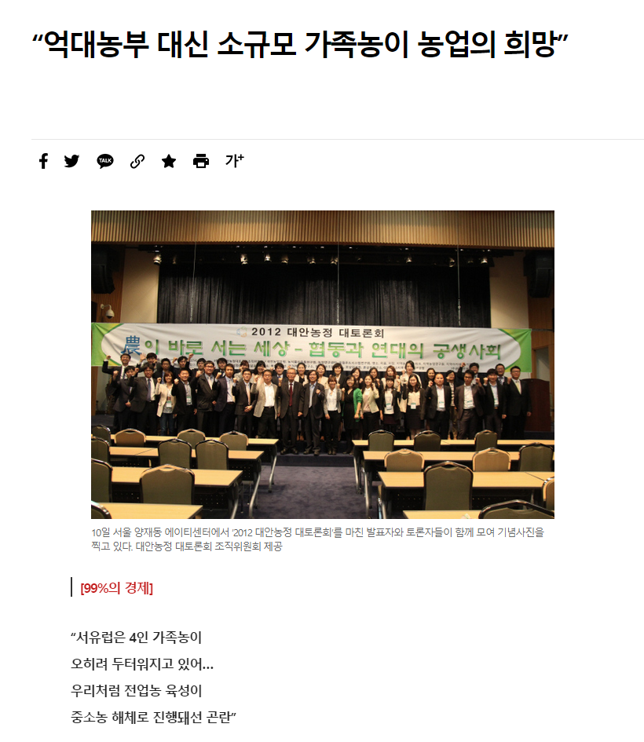
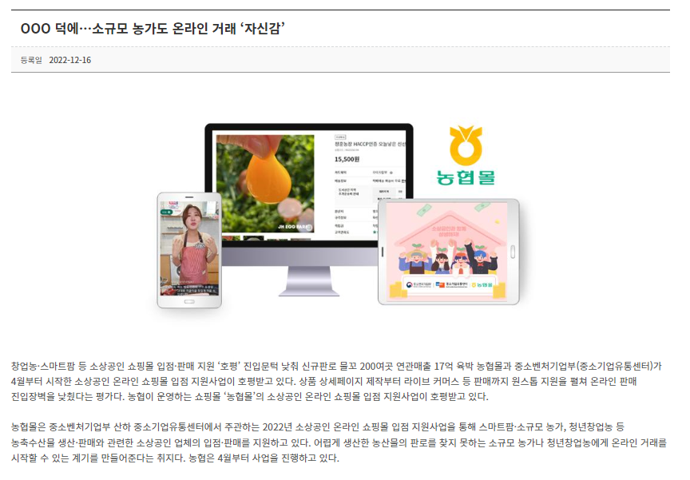
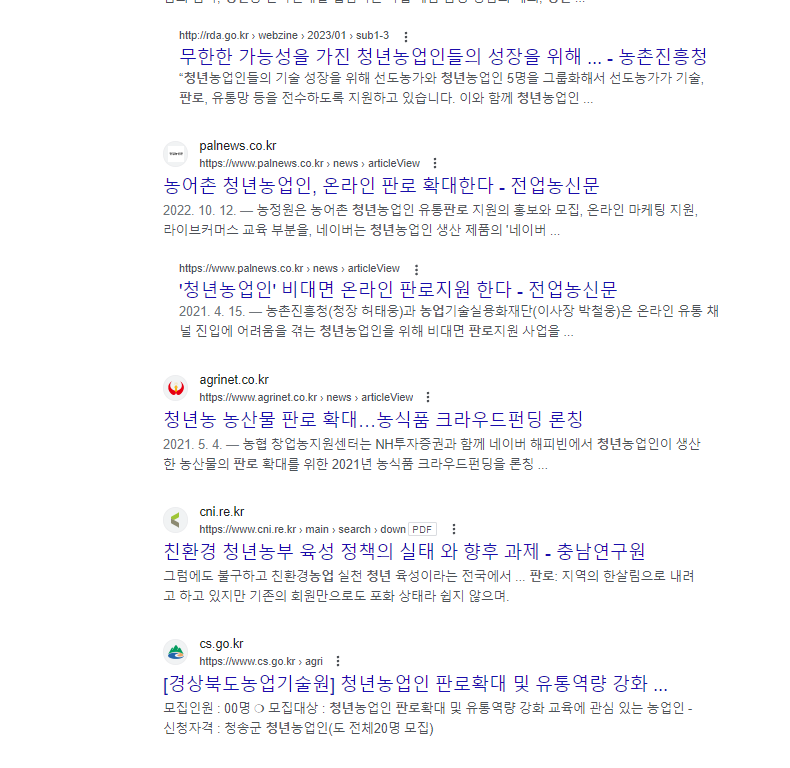
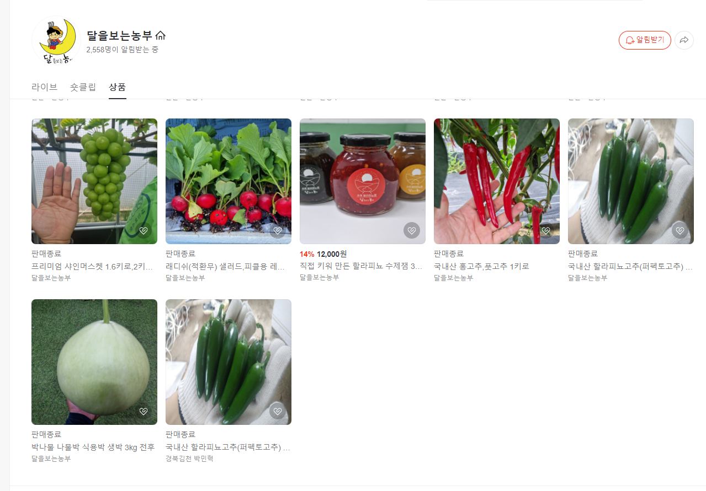
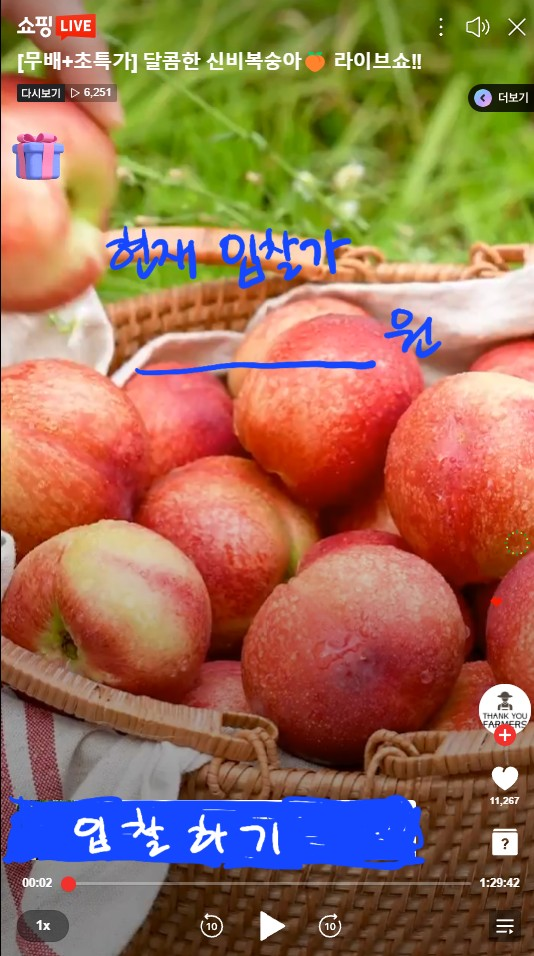

## 실시간 농산물 경매 서비스

### 배경

- 점차 줄어드는 농업 인구 → 소규모 농업인과, 청년 농업인들의 중요성이 늘어나고 있음
- 소규모 농업인과, 청년 농업인들은 그들의 성장을 위해 지원을 꾸준히 해줄 정도로 농산물 판로를 찾기 어려움

## 기획

- 어렵게 생산한 농산물의 판로를 찾지 못하는 소규모 농가나 청년 창업농에게 온라인 거래를 시작할 수 있도록
- 충청남도 로컬 푸드 매장 파머스처럼 소규모 생산자와 소비자를 연결할 수 있는 서비스
- 생산자의 농작물을 직접 경매해서 집으로 받아볼 수 있게 하여 로컬 푸드와 청년 창업농 활성화

## 페르소나

(판매자)생산자, 구매자

## 사용자의 입장 정리

(판매자)생산자 입장

- 초보 생산자는 상품 판매가 어려움
    - 상품 가치의 문제
    - 납품할 만큼의 규모의 생산을 하지 않음 등
- 직거래가 도매를 끼고 판매하는 것보다 수익이 좋음

구매자 입장

- 믿을 수 있는 제품을 소매보다 합리적인 가격으로 구매 가능
- 직접 상품을 실시간으로 보고 구매 가능

## 핵심 기능

- 생산자 등록
- 자신이 생산하는 농산물 소개 게시글
    
    
    

      이런 느낌으로 자신이 판매하는 상품 소개, 대신 가격 없이 소개만

- 경매 라이브 기능
    
    
    
    - 구매자는 입찰하기 버튼을 통해 입찰

- 리뷰 기능?

## 비슷한 서비스, 차별점

네이버 쇼핑 라이브

- 인증 절차가 복잡하니까 인증 절차를 간소화 하여 쉽게 라이브를 열 수 있도록
- 경매 기능을 통해 양쪽 모두 합리적 가격 책정 가능

## 기술

- WebRTC

규모는 별로 크지 않은데…. 기능을 더 추가하면 키울 수 있지 않을까

*배경, 니즈, 페르소나 (이런 사람이 이용하면 좋겠다), 비슷한 서비스도 있으면*

*핵심 기능, 차별점, 규모*

*판매자가 무엇을 판매하는 사람인지 대충 포트폴리오 개념으로 올릴 수 있는 기능이 있으면 좋겠음*

https://www.hani.co.kr/arti/economy/economy_general/555381.html

피드백

---

## 대신 입어주기

### 배경

https://news.coupang.com/archives/3535/

- 온라인에서 옷을 구매하는 데에 어려움을 느끼는 소비자들
    - 가장 큰 이유는 사이즈 문제
        - 모델이 너무 말라서, 체형이 나랑 달라서..
        - 구매 했는데 작지만 반품이 번거로워서 온라인 쇼핑을 점차 안하게 됨

## 아이디어

- 비슷한 스펙이 옷을 대신 입어주는 서비스
- 소개, 판매 구분해서 생각
    - 소개는 유튜버, 인플루언서들 처럼 자기가 구매한 옷 언박싱, 소개 느낌
        - 해당 사람들의 이익은 자기 채널 홍보
    - 판매는 쇼핑몰, 브랜드처럼 자기네들 제품 소개해서 판매
        - 해당 사람들의 이익은 홍보, 수익
- 방송을 시작할 때 키, 몸무게 선택해서 방송 시작
- 그 외 추가적인 기능들은 생각 필요