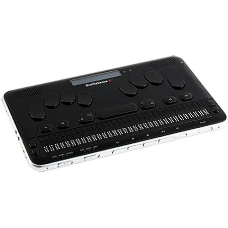
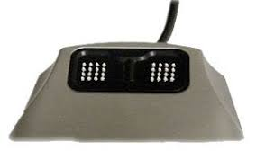
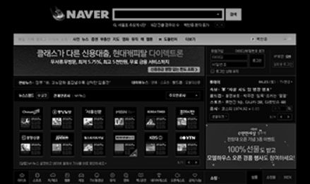

# 정규성 아이디어 정리

요약 내용(타이틀): 시각 장애우 보조 도구

# 시각 장애우 보조 도구

## 배경

- 시각 장애우와 같이 일해 본 경험이 있음
- 시각 장애우가 모두 전혀 못 보는 것은 아님(잘 안보이거나 색상 구분이 안가거나)
    - 실제 시각 장애우가 컴퓨터를 하는 과정
    - [https://www.youtube.com/watch?v=MbBwacqukQ0](https://www.youtube.com/watch?v=MbBwacqukQ0)
- 그래도 일반 웹 페이지를 이용하기에는 페이지 구성이나 색상 등 어려운 점이 많음
- 일상생활이 가능하고 전용 모니터 혹은 프로그램이 있다면 컴퓨터 사용 가능
- 모바일 화면 확대 software
    
    [Flowy[플로위]](https://atoverflow.com/42/?idx=175)
    

## 문제점

- 센스리더라는 음성 안내 프로그램도 있음
    - 고가이며 윈도우 전용
- 웹 페이지에 많은 정보가 있고 이를 찾기 위해 많은 노력이 들어감
    - 이를 위한 전용 페이지가 있지만 제작 비용을 고려하면 큰 포털 사이트 말고는 현실성이 떨어짐
    - 있더라도 주로 tab, enter 등을 이용해 상호작용하며, 원하는 엘리먼트를 찾기까지 시간이 오래 걸림
        
        [[네이버 온라인 장애 체험]](https://nax.naver.com/index)
        
- 마우스를 사용하면 커서 위치를 모름
    - 작은 마우스 포인터는 찾기도 어렵고 원하는 element 를 누르기는 더더욱 어려움
    - 전용 장비가 있지만 고가

모든 웹 페이지에서 사용 가능한 도움 프로그램이 있으면 좋을 것 같다!

## 핵심기능

- 마우스 크기 변경
- 커서가 가리키는 곳의 소리를 읽음
- 마우스 주변 페이지 확대
    - [https://m.blog.naver.com/PostView.naver?isHttpsRedirect=true&blogId=jjoommnn&logNo=220699136940](https://m.blog.naver.com/PostView.naver?isHttpsRedirect=true&blogId=jjoommnn&logNo=220699136940)
- 흑백페이지 혹은 색 반전 등
    - style = “filter: invert(100%) grayscale(100%);”

- 음성인식 혹은 직접검색을 통해 원하는 element 찾기
- 찾으려는 element 까지 마우스를 인도
    - sound 기반으로 현재 위치 기반 어디로 가시오
    - IOT 접목으로 마우스의 진동기능을 통해 가까워지도록
    - 혹은 자동으로 이동

## 차별점

- 기존 해결책과는 달리 모든 웹 사이트에서 사용가능
- 새로운 기기를 사용할 필요 없이 기존 도구를 사용가능

## 볼륨

- 서버는 필요없음
- 프로그램 형식으로 제작해서 배포

## 기술스택

- 배치파일 작성
    - 원하는 페이지를 조작하려면 debug 모드로 chrome을 열어야 함
- selenium + stt (maybe python…)
    - 음성인식이 유료 api 가 많지만 python 은 빠르고 쉽게 구현 가능

굳이 RTC를 적용하자면 화상채팅을 사용해서 화면 공유 기능과 함께 상담을 진행

- 상담을 해줄 인원에 대한 수익구조 설정이 어려움
- 실질적으로 상담하는 페이지를 찾아가기까지의 어려움
- 웹 서버, 웹 페이지 제작이 필요

